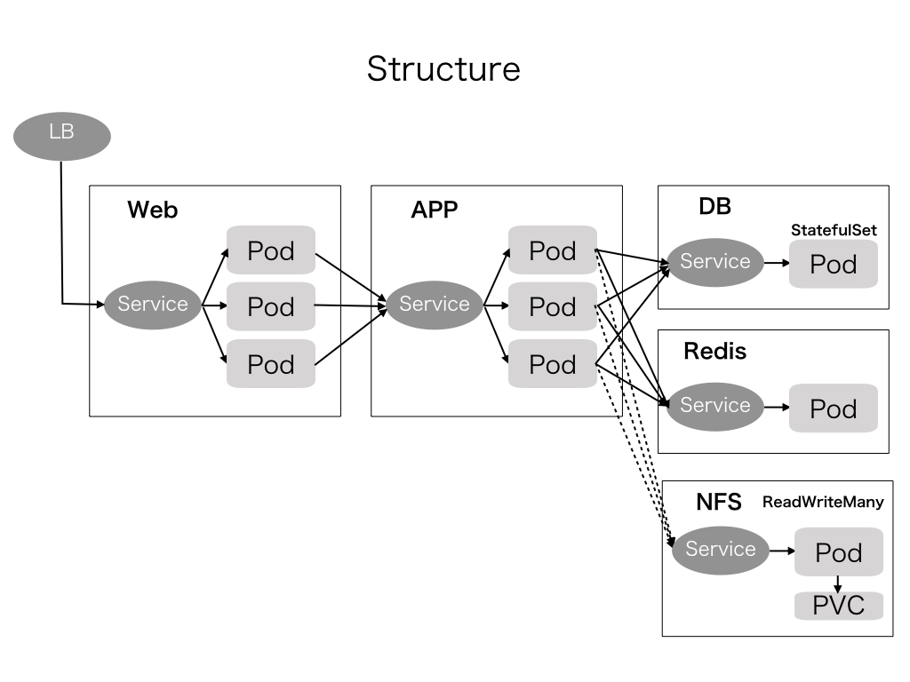

# Spring Boot demo application for Kubernetes

* This is a sample application for testing basic configuration of web application that is aimed to run on Kubernetes environment.
* The application consists of the following servers:
  * Web server (using nginx)
  * Application server (using tomcat [embedded in spring boot])
  * DB server (using postgres)
  * Session server (using redis for keeping application server's session)
  * Network Storage (Using PVC Dynamic provisioning or nfs)
* Web server and Application server are stateless, so they can be scaled to multiple pods.
* DB and Session server are stateful. Especially data on DB server must be kept permanently. While session server does not need to be permanent but if the data are lost, it causes poor user experience that means that users must login again and if user enter something to save, it can be lost. But compared to DB, it is not so critical.
* This demo uses single pod for both DB and Session server. If you want to use on production environment, I strongly suggest to use PaaS for both, at least for DB server.
* The application sample is for managing ToDos. It consists in only three pages. Just offering function of security and crud of database table. 
  * Login Page (ID/PW=admin/111111)
  * Todo List page
  * Todo Edit page
  * Todo contains uploaded images just for testing storage.
* The purpose is to know configuration of k8s, I made the source code as concise as possible, just enough to cover least functions to test. If you apply this to product, you might want to consider such as validation, security, maintainability, using framework, and so on.

## The system structure of this application on k8s



* In production environment, I strongly recommend to use PaaS for DB and Redis.
* The sample does not offer HA structure on DB and Redis. But the files of DB is not on container but on PV so that if DB is crashed for some reason, DB is automatically start up and data will not be lost unless problem occurs on the Volume.
* Redis is used with on-memory mode, so if redis is crashed, session is lost. Users have to login again. But this may not be a fatal problem. If you want to make it ha, consider using sentinel or redis by helm.
* You can configure high availability for DB using streaming replication by yourself. Statefulset-0 is used for master node and greater than 0 are used for slave nodes (You also have to use pgpool for judging master or slave). While this configuration is valid for HA, if you want to use failover (one of slaves promote to master), the order of statefulset become meaningless. In this case, I believe the advantage of using k8s is less than expected. You should use PaaS or Virtual Machine rather than unstable container.
* Along with DB, configuring shared Storage is another problem. We need to set up ReadWriteMany access for app pods. But standard Persistent Volume Claim may not support this mode. So we need set up manually nfs or glusterfs. If you want to store important data, you have to set up carefully. This example shows you to set up nfs.
  * see:  https://kubernetes.io/docs/concepts/storage/persistent-volumes/#access-modes

## The structure of this repository 

* src
  * Java(Spring Boot) Source
* deploy
  * Dockefile
  * k8s manifest
  * config file

Basically it is from standard spring boot project structure adding Docker and kubernetes deployments.

## Preparation for Local environment

### Prerequisite

The following application must be installed if you want to run and develop the application locally.

* JDK 8+
* Docker
* Postgres 9+
* Redis
* IntelliJ (or other IDEs)

### DB

* Install postgres and run postgres
* Run the following command (for Mac or Linux User. In Windows using pgadmin is much easier) and sql to create database and two tables.

```
initdb -A trust db
pg_ctl -D db -l logfile start

createuser -s postgres
psql -U postgres
create database demodb;
\q
```


```
psql -U postgres demodb

create table users (id integer primary key, login character varying(16) not null, password character varying(16) not null);
create unique index users_ux1 on users(login);
create table todos (id integer primary key, title character varying(16) not null, status integer default 0 not null, dt timestamp default now() not null);
create sequence todo_id_seq;

insert into users values(1, 'admin', '111111');
```

* If you install postgres on other than local, then you have to configure host, user and password on the following key in application.yml.
  * spring.datasource

### File

* create directory for saving uploaded images. You can change directory by setting value of app.picDir on application.yml.

```
sudo mkdir /opt/picDir
sudo chmod 777 /opt/picDir
```

### Redis

* If you use redis run on docker, follow the next instruction.

```
docker pull redis
docker run -d -p 6379:6379 --name redis redis:latest
```
* If you use redis on another server, then you have to change the following setting in application.yml.
  * app.redis


### RUN

* Open or Point the following java class on IDE
  src/main/java/net/in/dayan/springdemo/SpringdemoApplication
* Run the Application class
  * If you fail to start tomcat, classpath can be wrong. If there is .classpath file at the top of the project, delete and run again.
* Or, execute the command:
  * ./gradlew build -x test
  * java -jar build/libs/springdemo-0.5.0.jar
* Open browser and enter http://localhost:8080
* If login page is shown, enter ID and PW (admin/111111)
* Create todos. Enter title and upload file.

## RUN on Docker

```
# create jar
./gradlew build -x test

# image build
docker image build -t springdemo:apserver -f deploy/app/Dockerfile .

# To know redis ip address run on docker
docker inspect -f '{{range .NetworkSettings.Networks}}{{.IPAddress}}{{end}}' redis

# prepare picDir on host mounted from container
mkdir /tmp/picDir
chmod 777 /tmp/picDir

# Run application server on docker (If you run postgres and redis on other than local you have to change env variables)
docker run --name springdemo -d --rm -e "SPRING_PROFILES_ACTIVE=prd"  -e "DB_URL=jdbc:postgresql://host.docker.internal:5432/demodb?user=postgres&password=postgres" -e "PIC_DIR=/opt/picDir" -e "REDIS_HOST=host.docker.internal" -e "REDIS_PORT=6379" -v /tmp/picDir:/opt/picDir -p 8080:8080 -t springdemo:apserver

# show log
docker logs -f springdemo

# stop
docker stop springdemo

```

## nginx

```
docker image build -t springdemo:nginx -f deploy/web/Dockerfile2 .

docker run -d --rm  --name nginx -p 80:80 springdemo:nginx
```

## db
  
```
docker image build -t springdemo:postgres9.6 -f deploy/db/Dockerfile .

docker run -d -v ./postgres:/var/lib/postgresql/data --name postgres pspringdemo:postgres9.6
```

## redis

Use official image as it is.

## Configuration for K8S

### Prerequisite 

Before proceeding the following instructions, you need to prepare:

* Kubernetes Environment
  * Local(Docker for Mac, minikube, etc.)
  * GKE
  * Or others

The following instructions are confirmed by kuberenetes of Docker for Mac and GKE. If you tried other environment or had any problem on GKE, please let me know.


### image build & push

You should change docker repository for your own. You also have to  replace dayan888 to your repository in k8s manifest yaml.

* apserver

```
./gradlew build -x test

docker image build -t dayan888/springdemo:apserver -f deploy/app/Dockerfile .

docker push dayan888/springdemo:apserver
```

* web

```
docker image build -t dayan888/springdemo:nginx -f deploy/web/Dockerfile .

docker push dayan888/springdemo:nginx
```

* db

```
docker image build -t dayan888/springdemo:postgres9.6 -f deploy/db/Dockerfile .

docker push dayan888/springdemo:postgres9.6
```

### Create configmap for nginx

```
kubectl create configmap nginx-conf --from-file=deploy/web/nginx.conf 
kubectl create configmap server-conf --from-file=deploy/web/server.conf 
```

### Create deployments and services

Deployment should be in the following order:

* redis
* db
* apserver
* web
* lb or ingress

* Or, first create all services before creating deployment. Otherwise pod fail to start.
* after executed apply command, do the following command to check.

```
kubectl get pod --watch
```

* If you see pod status is "CrashLoopBackOff", then something must be wrong.

```
kubectl describe pod [podname]
kubectl logs [podname] -f
```


* redis

```
kubectl apply -f deploy/redis/deployment.yaml
kubectl apply -f deploy/redis/service.yaml
```

To check installation, do the following.

```
kubectl run --image=centos:6 --restart=Never --rm -it testpod sh
sh-4.1# yum install -y telnet
sh-4.1# telnet sbdemo-redis-service 6379
SET a 1
GET a
QUIT
```

* db

```
kubectl apply -f deploy/db/statefulset.yaml
kubectl apply -f deploy/db/service.yaml
```

To check installation, do the following.


```
kubectl run --image=postgres:9.6 --restart=Never --rm -it testpod sh
# psql -U postgres -h sbdemo-postgres-service demodb
demodb-# select * from users;
```

* nfs (For GKE environment)

GKE does not support pvc Access Mode with ReadWriteMay. So you need to configure by yourself. This is a little bit complicated but follow the instruction below for creating nfs on GKE.
At first you have to create nfs server using nfs server image that mounts pvc,

```
kubectl apply -f deploy/nfs/nfs-server-gke-pv.yaml
kubectl apply -f deploy/nfs/nfs-server.yaml
kubectl apply -f deploy/nfs/nfs-server-service.yaml
```

After that, create pv and pvc for this nfs server that will be mounted by app server pods.
First you need to get ip address of nfs server.

```
kubectl get svc
```

Then, copy CLUSTR-IP of sbdemo-nfs-server-service and replace value of spec.nfs.server in nfs-pv.yaml.
The value seems to be not service name that is usually preferable but ip address in case of nfs server.
Then execute the following commands.

```
kubectl apply -f deploy/nfs/nfs-pv.yaml
kubectl apply -f deploy/nfs/nfs-pvc.yaml
```

* apserver (For GKE environment)

```
kubectl apply -f deploy/app/deployment-gke.yaml
kubectl apply -f deploy/app/service.yaml
```

* apserver (For Local environment)

```
kubectl apply -f deploy/app/pvc.yaml
kubectl apply -f deploy/app/deployment.yaml
kubectl apply -f deploy/app/service.yaml
```

To check installation, do the following.

```
kubectl run --image=centos:6 --restart=Never --rm -it testpod sh
sh-4.1# curl -i http://sbdemo-apserver-service:8080/login
```

* web

Before applying this, do not forget to create configmap.

```
kubectl apply -f deploy/web/deployment.yaml
kubectl apply -f deploy/web/service.yaml
```

* LB / Ingress

If you don't need SSL, Load Balancer is easier to configure.

```
kubectl apply -f deploy/lb/loadbalancer.yaml
```

To check installation, do the following.

```
kubectl get svc --watch
```

Then, open a browser and enter url below with EXTERNAL_IP found in lb service list.

http://{EXTERNAL_IP}/login

If you use minikube or docker for kubernetes, enter.
http://localhost/login

* Ingress

Before proceeding ingress, create ssl certificate (for test) and secret

```
openssl req -x509 -nodes -days 365 -newkey rsa:2048 -keyout ~/tls.key -out ~/tls.crt -subj "/CN=sbdemo.example.com"
kubectl create secret tls --save-config tls-sbdemo --key ~/tls.key --cert ~/tls.crt
```

To use ingress, you need to create node port to access web server.

```
kubectl apply -f deploy/lb/nodeport.yaml
kubectl apply -f deploy/lb/ingress.yaml
```

After created, copy EXTERNAL IP of ingress and do the following command. It takes long time for EXTERNAL IP to be shown.

```
curl -i https://{INGRESS_IP} -H "Host: sbdemo.example.com" --insecure
```

If you get 502 error, GCE's health check goes to / path that returns 302(Redirect). In this case, you have to go to GCP console, move to network service and show load balancer. Then you need to change health check setting (path should be /login and port should be 80).

See. https://github.com/kubernetes/ingress-gce/blob/master/README.md#health-checks

This process also takes long time.
If you want to test on browser, you should edit hosts file on your local machine.

```
{INGRESS_IP}  sbdemo.example.com
```

If your browser give you ERR_SSL_VERSION_OR_CIPHER_MISMATCH, it means registering ingress is not finished yet. You have to wait more. Because this is self sgined certificate, you have to permit access to the site on browser.
 

To test balancing by path, create web server for test.

```
kubectl run web2 --image=gcr.io/google-samples/hello-app:2.0 --port=8080
kubectl expose deployment web2 --target-port=8080 --type=NodePort
```

* Confirm load balancing

To check apservers' behaviour, you can use stern. You can see the session is kept even processed by different pods.

```
stern -l app=sbdemo-apserver
```

Register todo with pic and reload browser, you can see like:

```
sbdemo-apserver-55f9d9d598-v6fqf apserver 2019-01-05 12:17:49.034  INFO 1 --- [nio-8080-exec-9] n.i.d.springdemo.common.LogInterceptor   : /todo/list
sbdemo-apserver-55f9d9d598-whrtw apserver 2019-01-05 12:17:49.116  INFO 1 --- [nio-8080-exec-1] n.i.d.springdemo.common.LogInterceptor   : /todo/pic/1
sbdemo-apserver-55f9d9d598-whrtw apserver 2019-01-05 12:17:56.358  INFO 1 --- [nio-8080-exec-2] n.i.d.springdemo.common.LogInterceptor   : /todo/list
sbdemo-apserver-55f9d9d598-whrtw apserver 2019-01-05 12:17:56.424  INFO 1 --- [nio-8080-exec-3] n.i.d.springdemo.common.LogInterceptor   : /todo/pic/1
sbdemo-apserver-55f9d9d598-whrtw apserver 2019-01-05 12:17:58.852  INFO 1 --- [nio-8080-exec-5] n.i.d.springdemo.common.LogInterceptor   : /todo/list
sbdemo-apserver-55f9d9d598-v6fqf apserver 2019-01-05 12:17:58.935  INFO 1 --- [io-8080-exec-10] n.i.d.springdemo.common.LogInterceptor   : /todo/pic/1
sbdemo-apserver-55f9d9d598-vkwjq apserver 2019-01-05 12:18:01.489  INFO 1 --- [nio-8080-exec-1] n.i.d.springdemo.common.LogInterceptor   : /todo/list
sbdemo-apserver-55f9d9d598-v6fqf apserver 2019-01-05 12:18:01.568  INFO 1 --- [nio-8080-exec-1] n.i.d.springdemo.common.LogInterceptor   : /todo/pic/1
sbdemo-apserver-55f9d9d598-vkwjq apserver 2019-01-05 12:18:03.028  INFO 1 --- [nio-8080-exec-2] n.i.d.springdemo.common.LogInterceptor   : /todo/list
sbdemo-apserver-55f9d9d598-vkwjq apserver 2019-01-05 12:18:03.090  INFO 1 --- [nio-8080-exec-3] n.i.d.springdemo.common.LogInterceptor   : /todo/pic/1
```

## Reset

If you want to do from the beginning, execute the following.

```
kubectl delete secret --all
kubectl delete configmap --all
kubectl delete all --all
```

## Quick start

You can use shell script to install quickly.

### Prerequisite

* kubectl
* stern
* open (You can also manually open browser and enter url.)

### minikube or Docker for desktop

```
sh deploy/sh/local.sh
```

### GKE

```
sh deploy/sh/gke.sh
```
